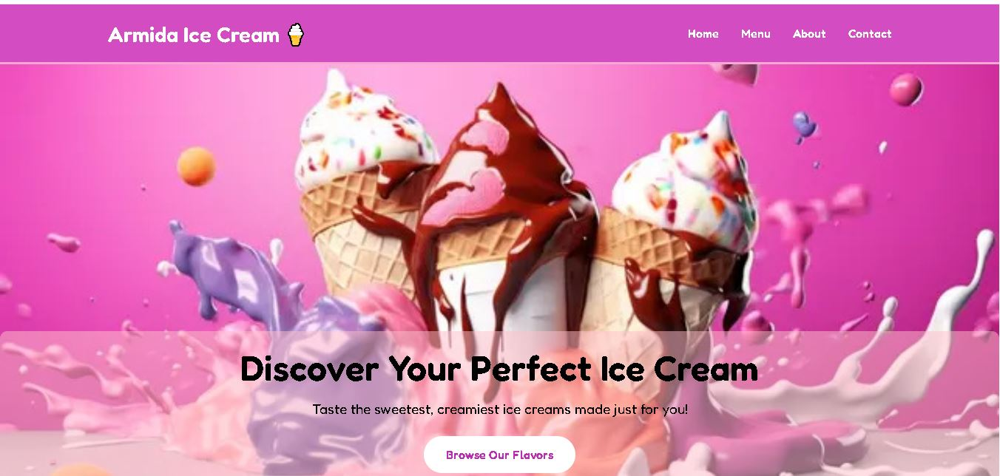

Hi there~! Welcome to my **Ice Cream Website Project** 🍦✨  
This is a sweet and delightful landing page made with lots of 💕 love and attention to cute design! 🌷

## 🍧 About This Project
Armida Ice Cream is a deliciously interactive front-end website showcasing:
- Aesthetic pink & pastel theme 🎨
- Google Fonts (Dancing Script, Lora, and Poppins) for a charming typography feel ✍️
- Smooth scroll animation with AOS 🪄
- Responsive design — works on all devices 📱💻

## 💖 Technologies Used
- HTML5 + CSS3  
- Bootstrap 4  
- AOS (Animate on Scroll)  
- FontAwesome + RemixIcons  
- GitHub Pages for free hosting  

## 🌐 Live Demo
✨ Check out the live version here:  
[https://CutArmidaAdhana.github.io/ice-cream-website](https://CutArmidaAdhana.github.io/IceCream-website) 🍓

## 📸 Preview

## 🧁 About Me

I'm **Cut Armida Adhana**, a passionate Front-End Developer who loves to create beautiful, cute, and meaningful web experiences. 🌸  
I enjoy combining clean code with playful design elements like pastel colors and smooth animations!  

Let’s connect! 💬  
[🌷 Instagram](https://www.instagram.com/ctrmdhn_)  
[🌸 TikTok](https://www.tiktok.com/@cutarmidaadhanaa)  
[🌼 My Portfolio](https://cutarmidaadhana.github.io/web-portofolio/)

---

> 🍡 Built with 💗 by Cut Armida Adhana
